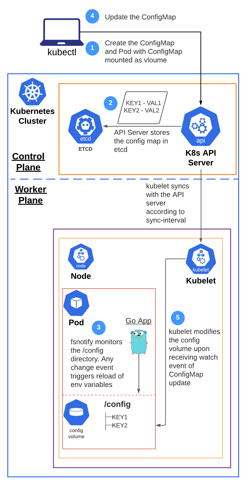

# Keep pod's environment variables in sync with updates in ConfigMap

It's a widely accepted practice to inject the environment variables into pods from ConfigMaps. This allows for more dynamic deployment of applications where the runtime properties need not be hardcoded into the application. But, there are some use cases where the the environment variables needs to be modified and the application needs to react to those changes. This creates a bit of an operational issue because Kubernetes does not automatically restart the pod or updates its environment variables if a referenced ConfigMap is updated.

However, Kubernetes does update the volume mounts of the pod if the ConfigMap is mounted to the pod. So the basic idea is alongwith setting the environment variables using ```envFrom``` and ```configMapRef```, we also mount the ConfigMap to the pod at a specific directory. And we monitor that configuration directory for any changes. This example application uses ```fsnotify``` which is a golang library which implements filesystem monitoring for many platforms. We also need to reprogram the application to monitor the configuration directory in the background and update the environment variables in the pod when any change event is received. The flow is described below:


### Flow Diagram


### Commands to create the resources
```
kubectl apply -f https://raw.githubusercontent.com/itselavia/dynamic-update-configmap-env-vars/main/configmap.yaml
```
```
kubectl apply -f https://raw.githubusercontent.com/itselavia/dynamic-update-configmap-env-vars/main/pod.yaml
```
```
kubectl apply -f https://raw.githubusercontent.com/itselavia/dynamic-update-configmap-env-vars/main/service.yaml
```

### Steps to test the service
- Launch a pod to to test the service via curl
```
kubectl run curl-test --image=radial/busyboxplus:curl -i --tty --rm
```
- Inside the curl test pod, get the value for environment variable KEY1
```
curl http://env-svc:8080/getEnvValue?var=KEY1
```
- Edit the env-vars ConfigMap and change the value of KEY1
```
kubectl edit cm env-vars
```
- Wait for about 30-60 seconds and get the value for environment variable KEY1. Now you should be seeing the updated value
```
curl http://env-svc:8080/getEnvValue?var=KEY1
```