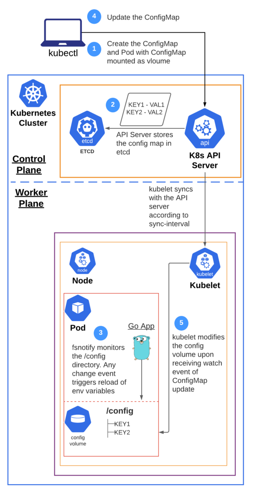

# Keep pod's environment variables in sync with updates in ConfigMap


### Flow Diagram


### Commands to create the resources
```
kubectl apply -f https://raw.githubusercontent.com/itselavia/dynamic-update-configmap-env-vars/main/configmap.yaml
kubectl apply -f https://raw.githubusercontent.com/itselavia/dynamic-update-configmap-env-vars/main/pod.yaml
kubectl apply -f https://raw.githubusercontent.com/itselavia/dynamic-update-configmap-env-vars/main/service.yaml
```

### Command to test the service
```
kubectl run curl-test --image=radial/busyboxplus:curl -i --tty --rm
```
```
curl http://env-svc:8080/getEnvValue?var=KEY1
```